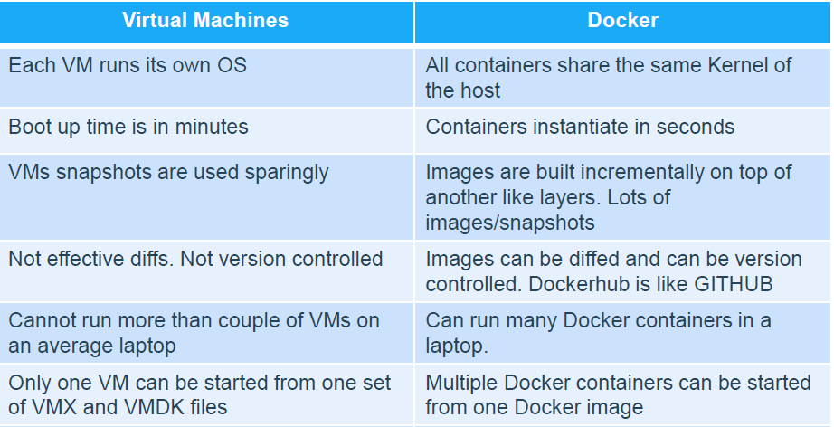

*This project has been created as part of the 42 curriculum by aboumall*

## Contents

- [Description](#description)
- [Instructions](#instructions)
- [Ressources](#ressources)
- [Project description (Docker)](#project-description-(Docker))


## Description

This project goal is to create an infrastructure of different services using docker containers with docker compose. Here is a quick overview of the mandatry part.

### Mandatory part

The mandatory part is composed of 3 services. All the services must have their own Dockerfile with its name. And the Dockerfile must be built from alpine or debian only, we are not allowed to use ready-make Docker images or using services like DockerHub.

#### 1. mariadb

A mariadb service that stores the website data in a mysql data base. It must have two users, one of them being the administrator, he must have all privileges. Also the service must have its own docker named volume.

#### 2. nginx

A nginx service with TLSv1.2 or TLSv1.3 only.

#### 3. wordpress php-fpm

A wordpress and php-fpm sevice that stores the wordpress website, it must not be built using nginx. Also a docker named volume must be created for the website data.

## Instructions

We are using docker compose for this project, as well as a Makefile that calls the docker compose file. Here is the commande you can use to run and destroy the project.

```bash
make
```
This command run 'docker compose up --build -d', which build and run the docker containers.

```bash
make down
make down-v
```
This command run 'docker compose down' or 'docker compose down -v', it stops the containers, the -v also deletes the volumes.

```bash
make clean
```
This one calls 'make down-v', and it also deletes the volumes from the host machine as well as running 'docker system prune -af' which deletes the images and the unsused ressources.

```bash
make re
```
This one does 'make down' and 'make'.

Before you run the containers you also need to make sure you have this pre requists :

- The directories for volumes '/home/login/data/wordpress' and '/home/login/data/mariadb', if they don't exist create them.
- The secrets directory and the secrets files, if you don't have it create it, as well as the secret files. You may chose the passwords of your choice. The files must be :
    - `secrets/db_password.txt`
    - `secrets/db_sup_password.txt`
    - `secrets/db_root_password.txt`
    - `secrets/wp_admin_password.txt`
- The alias for localhost to the website url 'login.42.fr'. For that check the /etc/hosts file, you need to have that line `127.0.0.1   login.42.fr` or `::1   login.42.fr`

Of course 'login' must be replaced by the student login.

## Ressources

I mainly used the docker documentation website for ressources. As well as chatGpt for wordpress or mariadb installation commands.

## Project description (Docker)

Here is a description of the project and docker.

### Virtual Machines vs Docker

#### What is Docker

Docker is an open-source platform developed by Docker, Inc. that allows developers to build, run and manage applications using containers.

Containers are lightweight and isolated environments that include their own filesystem, processes, and networking, while sharing the host operating system kernel.

Unlike virtual machines, Docker containers do not include a full operating system, which makes them faster and more efficient.

There are also alternative container platforms such as Podman.

#### Difference with VMs

The main difference between Docker and virtual machines is that virtual machines emulate the entire hardware and run a full operating system through a hypervisor, whereas Docker containers use operating system-level virtualization by sharing the host kernel while isolating applications.



#### When using Docker vs VMs

Docker is typically used when lightweight, fast, and scalable application deployment is needed. It is well-suited for microservices architectures, development environments, and continuous integration/continuous deployment (CI/CD), as containers start quickly and share the host system resources efficiently. 

Virtual machines, on the other hand, are preferred when strong isolation is required or when running different operating systems on the same machine. Since each virtual machine includes a full operating system, they provide a higher level of security and isolation, but at the cost of increased resource usage and slower startup times.

### Secrets vs Environment Variables

Docker secrets and environment variables are both used to pass configuration data to containers, but they differ in terms of security and use cases.

Environment variables (often defined in a `.env` file) are simple to use and commonly used for non-sensitive configuration such as ports, environment modes, or service names. However, they are not secure, as they can be easily accessed from the container, exposed in logs, or retrieved through inspection commands.

Docker secrets, on the other hand, are designed to securely store and manage sensitive data such as passwords, API keys, or certificates. They are encrypted and only accessible to specific services, typically through files mounted in the container, which limits their exposure.

In summary, environment variables are convenient for general configuration, while Docker secrets should be used for sensitive information that requires a higher level of security.

### Docker Network vs Host Network

Docker provides multiple networking options to connect containers, with two common modes being the default bridge network and host network.

#### Docker Network (bridge mode)

In this mode, Docker creates a virtual network isolated from the host. Each container gets its own IP address and communicates with other containers through the bridge. This provides **isolation and control** over ports, but adds a slight overhead for network translation (NAT).

#### Host Network

In host mode, a container shares the host's network stack directly. There is **no network isolation**: the container uses the same IP as the host, and ports are directly accessible. This can improve performance and simplify networking, but reduces security and isolation between containers and the host.

In summary, bridge networks provide isolation and flexibility, while host networks offer performance at the cost of reduced isolation.

### Docker Volumes vs Bind Mounts

Docker provides two main ways to persist and share data between containers and the host: volumes and bind mounts.  

#### Docker Volumes

Volumes are managed by Docker and stored in a special location on the host (`/var/lib/docker/volumes/` by default). They are easy to create, backup, and migrate. Volumes are ideal for storing persistent data like databases, and Docker handles the access permissions and storage lifecycle.

#### Bind Mounts
Bind mounts allow you to mount a file or directory from the host filesystem directly into a container. This gives you full control over the data location and is commonly used during development to sync code between host and container. However, bind mounts depend on the host path, can be less portable, and require careful permission management.

#### Summary

- Use **volumes** for persistent, portable, and Docker-managed data.  
- Use **bind mounts** for development, direct host access, or when you need full control over file locations.


